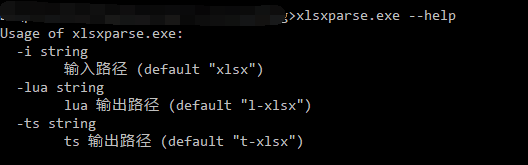

## excel 转换工具

该工具是我[之前的工具](https://github.com/shuimu98/domi-lab/tree/master/golang/xlsx2lua)的修改版，主要为了支持新的H5项目，支持`lua`和`typescript`格式的。

### 生成lua配置

与之前的差不多，只是干掉了翻译功能，并优化了一版。

### 生成ts配置

为了减小配置的大小，采用了msgpack的方式打包数据，并使用zip压缩。最终的配置数据生成为一个`data.dat`文件。

## 使用

直接运行`xlsxparse.bat`，生成ts配置时，需要配合`t-xlsx/ConfigParser.ts`。

